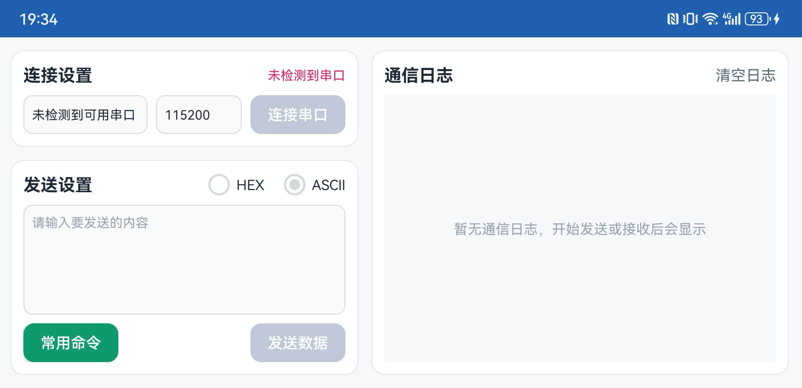
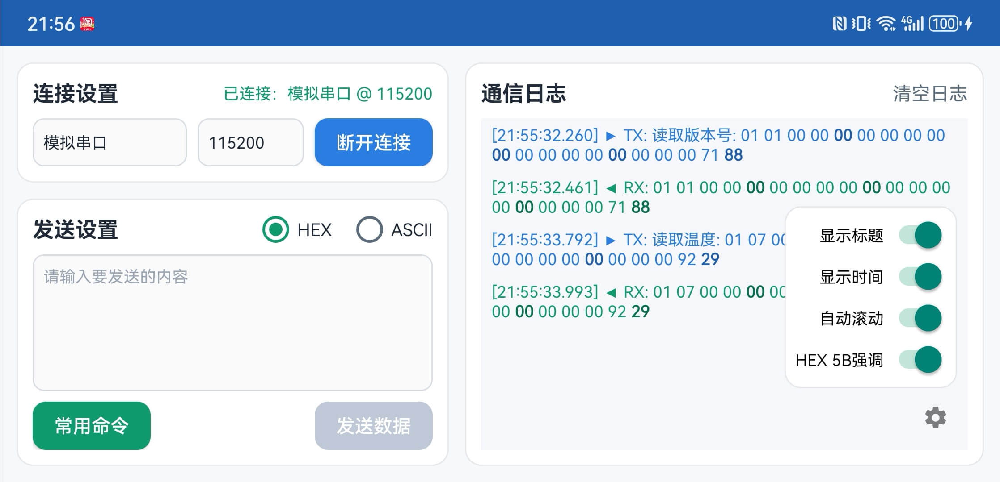
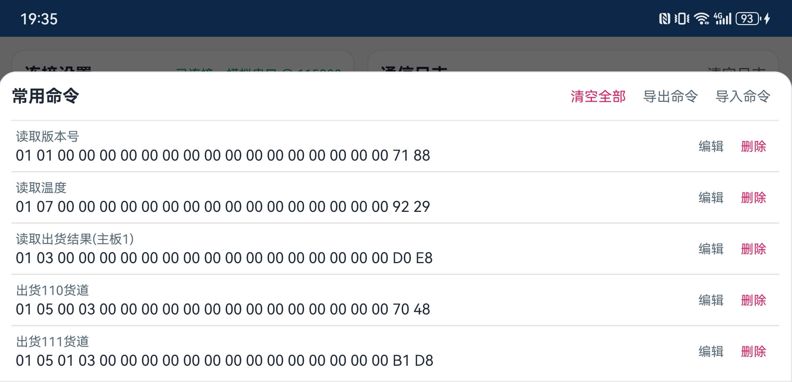

# 调试工具APP

这是基于 AndroidSerialPort 项目的串口测试App，用来做串口收发和调试。  
第一次用串口的话，按下面流程走即可：**连接串口 → 发送指令 → 看回传**。

## APK 下载
[点击下载 APK](apk/TMPortTest_2602042012.apk)

## 功能说明
- **连接/断开**：右上角状态栏会显示连接状态与当前串口。
- **ASCII / HEX 模式**  
  - ASCII：直接输入普通文本。  
  - HEX：只能输入 `0-9 a-f A-F`，长度必须是偶数，空格会自动忽略。  
    示例：`AA 03 3C 00 00 E9`
- **日志区**：显示发送与接收的内容，可显示时间与方向标识，支持自动滚动。
- **常用指令**：可保存常发指令，支持新增/编辑/删除/导入/导出。
- **内置指令**：长按“导入命令”可选择内置命令。
- **模拟串口**：没有硬件时用来演示或联调。
  - 长按状态栏（右上角状态提示区域）可开启/关闭模拟串口（在没有真实串口时更容易触发）。
  - 开启后会出现 “Mock” 串口选项，可直接连接进行演示。

## 面向研发的提示
将命令文件放在 `app/src/main/assets/common_commands` 目录下，打开“导入命令”长按即可自动读取。

## 常见问题
- **串口下拉为空**  
  可能是设备没有开放串口权限，或本机没有串口节点。  
  你可以先开启 **模拟串口模式** 验证流程。
- **连接失败**  
  请确认串口是否被其他进程占用，或是否需要系统权限/Root。
- **发送按钮不可点**  
  通常是未连接，或 HEX 输入格式不合法（奇数长度/含非法字符）。

### 1) 主界面与连接设置

> 默认的主页样式

### 2) 模拟串口模式

> 开启模拟模式后的状态提示与收发演示。

### 3) 发送与接收日志

> 发送输入区、ASCII/HEX 切换、日志列表。

### 4) 常用指令管理

> 常用指令列表、导入/导出入口、编辑/删除操作。
